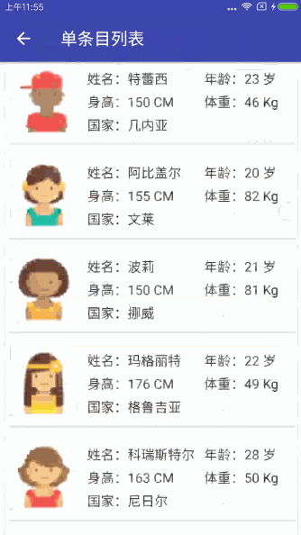
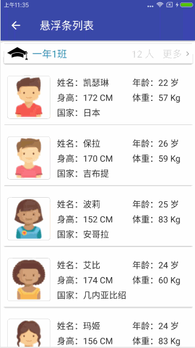
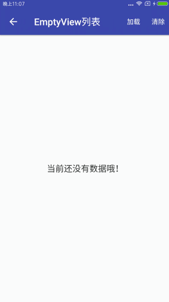

# MultiTypeAdapter

###### 它最大的特点就是不需要你继承Adapter并重写Adapter中的方法。大大的节省你的开发时间提高你的改法效率。

### 简介
    针对RecyclerVeiw的适配器的封装，可以令你简单优雅的实现一些常用功能。
    例如：单条目列表、多条目列表、悬浮列表、分页加载、Empty列表以及各种针对条目的事件的监听。

#### 单条目列表

###### 实现代码
```
private SingleTypeAdapter<Person, ManHolder> mAdapter;

    @Override
    protected void onCreate(Bundle savedInstanceState) {
        super.onCreate(savedInstanceState);
        setTitle("单条目列表");
        setContentView(R.layout.include_common_list_layout);

        RecyclerView recyclerView = (RecyclerView) findViewById(R.id.recyclerView);
        mAdapter = new SingleTypeAdapter<>(recyclerView, ManHolder.class);
        recyclerView.setAdapter(mAdapter);
        loadData();
    }

    private void loadData() {
        DataHelper.getInstance().getPersons().subscribe(new Action1<List<Person>>() {
            @Override
            public void call(List<Person> persons) {
                mAdapter.setDataList(persons);
                mAdapter.notifyRefresh();
            }
        });
    }
```
#### 多条目列表

###### 实现代码
```
    private MultiTypeAdapter mMultiTypeAdapter;
    @Override
    protected void onCreate(Bundle savedInstanceState) {
        super.onCreate(savedInstanceState);
        setTitle("多条目列表");
        setContentView(R.layout.include_common_list_layout);
        RecyclerView recyclerView = (RecyclerView) findViewById(R.id.recyclerView);

        mMultiTypeAdapter = new MultiTypeAdapter(recyclerView, 2);  //构建一个最多可将屏幕分为两份的多类型适配器。
        recyclerView.setAdapter(mMultiTypeAdapter);
        loadData();  //加载数据
    }

    private void loadData() {
        //模拟从网络获取数据。
        DataHelper.getInstance().getManAndWoman().subscribe(new Action1<People>() {
            @Override
            public void call(People people) {
                ItemAdapter<Integer> titleAdapter; //用来加载显示头的子适配器。
                ItemAdapter<Person> personAdapter; //用来显示条目的适配器
                //创建女生的头的子适配器。
                titleAdapter = new ItemAdapter<Integer>(CommonImageHolder.class, people.getWomanListImage());
                //创建用来显示女生列表的子适配器。
                personAdapter = new ItemAdapter<Person>(people.getWomanList(), 1, ManHolder2.class);
                //将两个子适配器添加到多类型适配器中。
                mMultiTypeAdapter.addAdapter(titleAdapter, personAdapter);

                //在创建一个男生的头的子适配器。
                titleAdapter = new ItemAdapter<Integer>(CommonImageHolder.class, people.getManListImage());
                //在创建一个用来显示男生列表的子适配器。
                personAdapter = new ItemAdapter<Person>(people.getManList(), 2, ManHolder.class);
                //将两个子适配器添加到多类型适配器中。
                mMultiTypeAdapter.addAdapter(titleAdapter, personAdapter);

                //刷新列表
                mMultiTypeAdapter.notifyRefresh();
            }
        });
    }
```
#### 悬浮吸顶条目列表

#### 分页加载

```
    /**
     * 定义每页的数量。
     */
    public static final int PAGE_SIZE = 10;
    /**
     * 记录当前需要加载的页数。
     */
    private int mPage = 1;
    private MultiTypeAdapter mMultiTypeAdapter;
    private ItemAdapter<Person> mItemAdapter;

    @Override
    protected void onCreate(Bundle savedInstanceState) {
        super.onCreate(savedInstanceState);
        setTitle("分页加载");
        setContentView(R.layout.include_common_list_layout);

        final RecyclerView recyclerView = (RecyclerView) findViewById(R.id.recyclerView);
        mMultiTypeAdapter = new MultiTypeAdapter(recyclerView);
        recyclerView.setAdapter(mMultiTypeAdapter);
        //添加一个头条目。
        mMultiTypeAdapter.addAdapter(new ItemAdapter<Integer>(CommonImageHolder.class, R.mipmap.img_common_title));
        //创建用来显示内容的子条目。
        mItemAdapter = new ItemAdapter<>(ManHolder.class);
        //将子条目添加到多类型Adapter中。
        mMultiTypeAdapter.addAdapter(mItemAdapter);
        //设置加载更多的布局，有重载方法。这里用的是五个参数的，前三个分别是 加载中、点击重试和没有更多数据时显示的布局文件。
        //第四个参数是偏移值，就是在最后一个条目之前的第几个条目被显示时触发加载更多，最后一个是加载更多的回调。
        mMultiTypeAdapter.setLoadMoreView(R.layout.layout_load_more, R.layout.layout_load_more_failed, R.layout.layout_no_more_data, 1, new MultiTypeAdapter.OnLoadMoreListener() {

            @Override
            public void onLoadMore() {
                //模拟耗时操作。
                recyclerView.postDelayed(new Runnable() {
                    @Override
                    public void run() {
                        loadData(++mPage, PAGE_SIZE);
                    }
                }, 500);
            }

            @Override
            public void onReloadMore() {
                //模拟耗时操作。
                recyclerView.postDelayed(new Runnable() {
                    @Override
                    public void run() {
                        loadData(mPage, PAGE_SIZE);
                    }
                }, 500);
            }
        });
        loadData(mPage, PAGE_SIZE);
    }

    private void loadData(int page, int pageSize) {
        //加载数据
        DataHelper.getInstance().getPersons(page, pageSize).subscribe(new Subscriber<List<Person>>() {
            @Override
            public void onCompleted() {}

            @Override
            public void onError(Throwable e) {
                if (mMultiTypeAdapter.getItemCount() <= 10) {
                    //设置LoadMore不可用，因为如果当前总数据不足以显示一屏幕则会出现一只显示加载中却总也触发不了LoadMore的bug。
                    mMultiTypeAdapter.setLoadMoreUsable(false);
                } else {
                    //设置加载更多可用。
                    mMultiTypeAdapter.setLoadMoreUsable(true);
                    //设置加载更多完成。
                    mMultiTypeAdapter.setLoadMoreFailed();
                }
            }

            @Override
            public void onNext(List<Person> persons) {
                //将获取到的数据添加到子适配其中，这个addAll也是有重载方法的，这里调用的是一个参数的方法，这个方法默认会在添加数据后刷新列表。
                mItemAdapter.addAll(persons);
                //判断是否是最后一页了，一般情况下如果服务器给的数据是空的或者给的数据量不满足我们请求的pageSize就认为是最后一页了。
                if (persons.isEmpty() || persons.size() < PAGE_SIZE) {
                    mMultiTypeAdapter.setNoMoreData(); //设置没有更多数据了。
                } else {
                    mMultiTypeAdapter.setLoadMoreFinished();  //设置加载更多完成。
                }
            }
        });
    }
```
#### EmptyView列表

###### 实现代码
```
    private SingleTypeAdapter<Person, ManHolder> mAdapter;
    @Override
    protected void onCreate(@Nullable Bundle savedInstanceState) {
        super.onCreate(savedInstanceState);
        setTitle("EmptyView列表");
        setContentView(R.layout.include_common_list_layout);

        RecyclerView recyclerView = (RecyclerView) findViewById(R.id.recyclerView);
        mAdapter = new SingleTypeAdapter<>(recyclerView, ManHolder.class);
        mAdapter.setEmptyView(R.layout.layout_common_empty_layout);  //设置列表为空要显示的布局ID。
        recyclerView.setAdapter(mAdapter);
    }

    private void loadData() {
        //加载数据
        DataHelper.getInstance().getPersons().subscribe(new Action1<List<Person>>() {
            @Override
            public void call(List<Person> persons) {
                mAdapter.setDataList(persons);
                mAdapter.notifyRefresh(); //刷新列表
            }
        });
    }

    @Override
    public boolean onCreateOptionsMenu(Menu menu) {
        //添加两个menu用来操作清空列表和加载数据。
        getMenuInflater().inflate(R.menu.menu_load, menu);
        getMenuInflater().inflate(R.menu.menu_clear, menu);
        return super.onCreateOptionsMenu(menu);
    }

    @Override
    public boolean onOptionsItemSelected(MenuItem item) {
        switch (item.getItemId()) {
            case R.id.menu_load:  //如果点击了加载数据则进行加载数据。
                loadData();
                break;
            case R.id.menu_clear:  //如果点击了清空列表则进行清空列表。
                mAdapter.clear();
                break;
        }
        return super.onOptionsItemSelected(item);
    }
```


### License
```
MIT License

Copyright (c) [year] [fullname]

Permission is hereby granted, free of charge, to any person obtaining a copy
of this software and associated documentation files (the "Software"), to deal
in the Software without restriction, including without limitation the rights
to use, copy, modify, merge, publish, distribute, sublicense, and/or sell
copies of the Software, and to permit persons to whom the Software is
furnished to do so, subject to the following conditions:

The above copyright notice and this permission notice shall be included in all
copies or substantial portions of the Software.

THE SOFTWARE IS PROVIDED "AS IS", WITHOUT WARRANTY OF ANY KIND, EXPRESS OR
IMPLIED, INCLUDING BUT NOT LIMITED TO THE WARRANTIES OF MERCHANTABILITY,
FITNESS FOR A PARTICULAR PURPOSE AND NONINFRINGEMENT. IN NO EVENT SHALL THE
AUTHORS OR COPYRIGHT HOLDERS BE LIABLE FOR ANY CLAIM, DAMAGES OR OTHER
LIABILITY, WHETHER IN AN ACTION OF CONTRACT, TORT OR OTHERWISE, ARISING FROM,
OUT OF OR IN CONNECTION WITH THE SOFTWARE OR THE USE OR OTHER DEALINGS IN THE
SOFTWARE.
```
